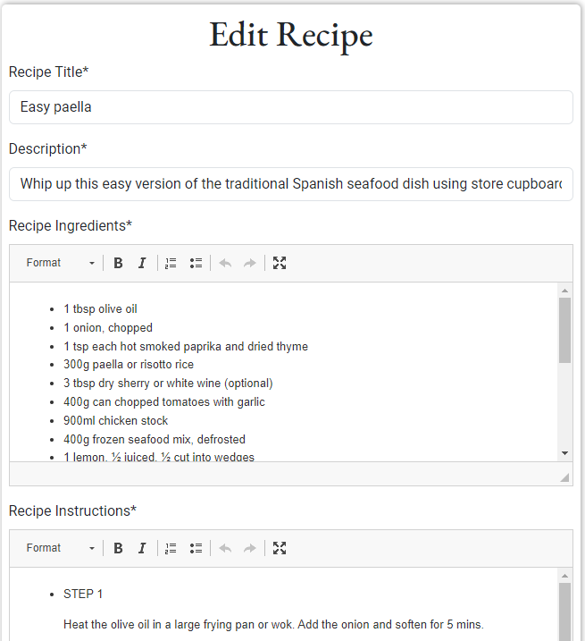

# Protein Planner

## A High Protein Meal Planning website
>
> The Protein Planner is a meal planning app which is designed to target users who want to maximise their daily protein intake. The app allows users to create a meal plan for every meal for every day of the week!

The site acts as a repository for recipes whereby users can store their own recipes and also browse other users' recipes. Users can get organised for the week ahead by adding recipes to their meal planner for each meal for every day of the week.

### - By Patrick Grant

## **[Live site](https://proteinplanner-f5152efcdae3.herokuapp.com/)**

---

## **[Repository](https://github.com/PatrickG0308/PP4_Protein_Planner)**

## Table of contents

<a name="contents">Back to Top</a>

 1. [UX](#ux)
 2. [Agile Development](#agile)
 3. [Features](#features)  
 4. [Features Left to Implement](#left)  
 5. [Technology used](#tech)
 6. [Testing](#testing)  
 7. [Bugs](#bugs)  
 8. [Deployment](#deployment)
 9. [Credits](#credits)
 10. [Content](#content)  
 11. [Acknowledgements](#acknowledgements) 
 
 ---
## Agile Development

### Agile Overview

This project was started alongside a GitHub Projects Page to track and manage the expected workload ahead.
The aim was to set out my expected workload, list the epics and then break them down into user stories or bite sized tasks to work towards and ultimately finish the site in good time.

To see Kanban please click [here](https://github.com/users/PatrickG0308/projects/13).

At the initial stages I decided on 9 core requirements for the project and 2 would likes but not important. (**Would Like**).

From these I added the user stories with acceptance criteria so I can track my work effectively.

Once I completed a task I would move it from **in progress** to **completed**.

#### User stories

##### Completed User Stories

To view any of the expanded details of the user stories please click on a user story below to be taken to the Kanban project.
If the specific user story does not auto pop up then please click on it from the project page and you will see the details and comments.

 1. [USER STORY: Create Base, Navbar and Footer](https://github.com/users/PatrickG0308/projects/13/views/1)
 2. [USER STORY: Search facility](https://github.com/PatrickG0308/PP4_Protein_Planner/issues/2)
 3. [USER STORY: Site Admin Authentication](https://github.com/PatrickG0308/PP4_Protein_Planner/issues/3)
 4. [USER STORY: Create Recipe function](https://github.com/PatrickG0308/PP4_Protein_Planner/issues/4)
 5. [USER STORY: Add Meal Planner](https://github.com/PatrickG0308/PP4_Protein_Planner/issues/5)
 6. [USER STORY: User Profile](https://github.com/PatrickG0308/PP4_Protein_Planner/issues/6)
 7. [USER STORY: Create Homepage](https://github.com/PatrickG0308/PP4_Protein_Planner/issues/7)
 8. [USER STORY: Existing User Login](https://github.com/PatrickG0308/PP4_Protein_Planner/issues/8)
 9. [USER STORY: New User registration](https://github.com/PatrickG0308/PP4_Protein_Planner/issues/9)

The following User stories were not completed as they were deemed to be not necessary for this project at this time but are indications of possible future features:

##### Would Like

 1. [USER STORY: Monthly Meal Planner](https://github.com/PatrickG0308/PP4_Protein_Planner/issues/10)
 2. [USER STORY: Paginate Recipes Page](https://github.com/PatrickG0308/PP4_Protein_Planner/issues/11)
 3. [USER STORY: Add Social account login](https://github.com/PatrickG0308/PP4_Protein_Planner/issues/12)

[Back to Top of page](#contents)

---

## Features

#### User based Features Implemented

- **Users can** create an account (**Create**)
- **Users can** log into their account
- **Users can** log out of their account
- **Users can** add a recipe **(Create)**
- **Users can** access their profile page & view their information and their recipes and meal plans **(Read)**
- **Users can** add their name, image and description to their profile (**Create**)
- **Users can** edit their image or any other information they have on their profile (**Update**)
- **Users can** edit their recipes and meal plans (**Update**)
- **Users can** delete their recipes at any time (**Delete**)
- **Users can** view other users recipes for use in their meal plan

#### Account restrictions

- **Users cannot** access the profile section of an account without being logged in
- **Users cannot** access their profile or meal plan until they sign up or login
- **Users cannot** edit another users recipe or view their meal plan.
- **Users cannot** edit their account number as this is their UserID and a primary key
- **Users cannot** see other users meal plans or profiles
- **Users cannot** access the admin panel of the website unless they have admin status
---

#### Website features

### index.html

- The homepage consists of a header with a logo and 4 Navigation links plus a search bar.
- The main section explains the workings of the site and outlines the benefits of protein in a persons diet. it also shows a protein circle with a selection of protein rich foods and the protein values in grams.
- the footer of the page provides links to social media sites, linkedin, instagram, github and facebook.
- The Header and footer page display through the whole site.

#### Header

> Site Navigation

- The consists of a Home, Recipes, Sign Up, Login and search area.
- If the user is logged in they have access to profiles through the profile icon and have the ability to add recipes through the add button.

---

#### Main

- The navative outlines the purposes and benefits of the site, as well as the benefits of protein in a person's meal selection
- It also offers a Sign Up button for a new user to register for full access to the profile, meal planner and add recipe portion of the site.

#### Footer

- The footer offers links to social media sites such as linkedin, Instagram, Github and Facebook
---

### recipes.html

#### Latest Recipes

- When a user is not authenticated and they select the recipes link from the header they are presented with the Latest recipes available on the site with an image of the meal and a very brief description.
- The unauthenticated user can select the recipe which will provide the user with the full description of the recipe, including Calorie and protein count, ingredients and instructions on how to prepare the meal.

---

### signup.html

#### Sign Up

- The sign up page for new users requests users to enter a e-mail address,
  a username and a password. The password requirements are clearly outlined to the user and a message will appear if the criteria is not followed.
- Once the user presses the Sign Up button they are brought into the authenticated users area of the site were they will have access to their newly created profile, add recipes area and create a meal plan.
---

### login.html

#### Sign In

- Already registered users can use the Login link on the header to easily access their content
- Their registered username and password are reqiuired and a remember me check box is available for future logins
- A forgot password button is available and this will bring you to the All Auth password reset page but this feature at time of writing has not been wired up. It has been added to the project planner as a would like issue to complete at a later date.
  
---
### index.html - Signed in User

#### Header

- When a user has authenticated the are presented with 2 new navigation links, Add (add new recipe), Profile
  
#### Main

- Authenticated user is presented with a "Welcome back to your Protein Planner" message
- User is presented with an Add Recipe button which when pressed will bring the user directly to the Add Recipe page.
- User is presented with a Create Plan button which when pressed will bring user directly to the Meal Planner page
---

### add.html

#### Add recipe

- User is requested to add the following...
    - Recipe Title
    - Recipe description
    - Recipe Ingredients
    - Recipe Instructions
    - Recipe Image
    - Describe image (for impaired users benefit)
    - Meal Type (Choice of 3)
        - Breakfast
        - Lunch 
        - Dinner
    - Protein Content
    - Calorie Count
    - Create Recipe Button
 ---
  
  ### profile.html

  #### Profile
  
  

  - Users profile page contains the following content
    - User profile image
    - User joined date
    - User recipe count
    - User profile description
    - User profile Edit button 
    - Meals button - redirects user to the meal planner page
    - List of the users latest recipes which can be selected to direct user to there entered recipes
 ---
  #### User Profile Edit
  

  - User can edit their image \ avatar
  - User can change the details in their Bio
  ---

### meal_planner.html

#### User Profile Meals

  - When user clicks the Meals button in their profile they are directed to their Weekly Meal Planner page.
  - The meal planner is designed to start on the Monday and finish on the Sunday
  - User clicks on the desired date

 
  
 - User is requested to select a meal type

  - User can search by max protein count
  - User can search by keyword
  - User can find random recipe
  - Once happy with choice user can add to meal
  - This process can be repeated for all meal types
  - Selected meals can be changed just by adding a different meal.

---
  

  #### User Profile Edit Recipes
  
  

   - When user clicks one of their added recipes listed in their profile

   
   
   - User is presented with a detailed summary of their recipe including calories, protein content, ingredients and instructions.
   - User presented with an Edit button allowing user to edit their recipes
   - User is presented with a delete button allowing user to delete their recipes.
---  
  #### Edit Button
  
   
   

   - Allows user to edit every aspect of their recipe
---
#### Delete Button

  
  
  - User is asked to confirm deletion of recipe
---

 
  
  

  
  

