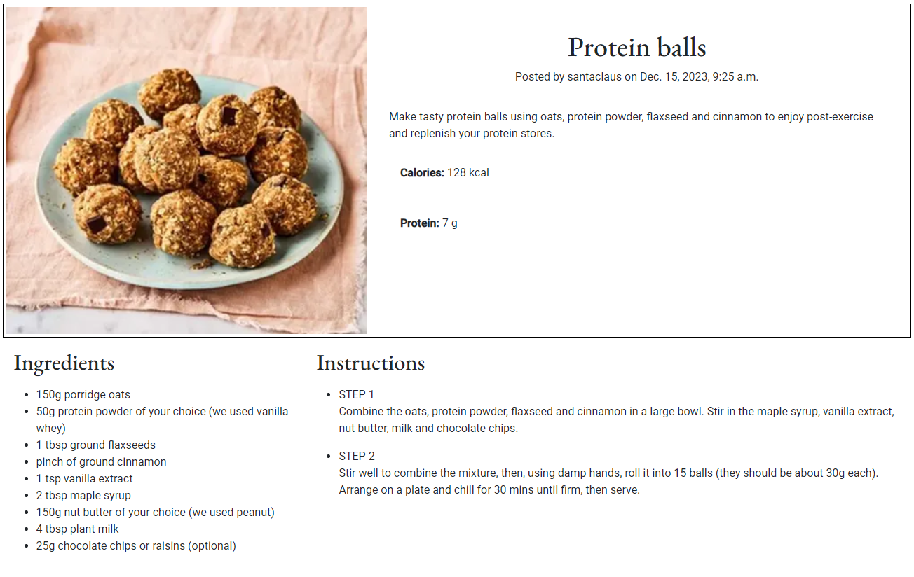
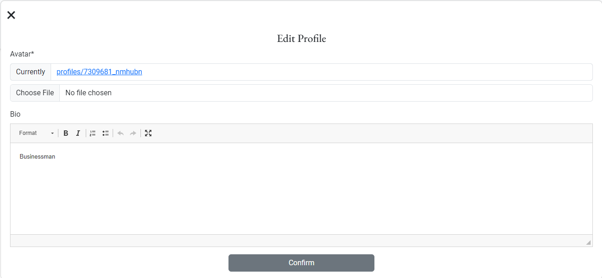

# Protein Planner

## A High Protein Meal Planning website

 The Protein Planner is a meal planning app which is designed to target users who want to maximise their daily protein intake. The app allows users to create a meal plan for every meal for every day of the week!

The site acts as a repository for recipes whereby users can store their own recipes and also browse other users' recipes. Users can get organised for the week ahead by adding recipes to their meal planner for each meal for every day of the week.

### - By Patrick Grant

## **[Live site](https://proteinplanner-f5152efcdae3.herokuapp.com/)**

---

## **[Repository](https://github.com/PatrickG0308/PP4_Protein_Planner)**

## Table of contents

## Contents

 1. [UX](#ux)
 2. [Agile Development](#agile-development)
 3. [Features](#features)  
 4. [Features Left to Implement](#feature-left-to-implement)  
 5. [Technology used](#technology-used)
 6. [Testing](#testing)  
 7. [Bugs](#bugs)  
 8. [Deployment](#deployment)
 9. [Credits](#credits)
 10. [Acknowledgements](#acknowledgments)

---

## UX

#### Pre-project Planning

> Database Structure

- When I decided on my initial concept of the Protein Planner I knew I needed to understand what type of data I would need to store and the relationships between them.
- I created the above diagram on lucidchart to help me understand the relationships.

### Database Schema

#### User Model

| id | Field |
|--|--|
|user_id |PK|
|username |Charfield|
|email|EmailField|
|password|CharField|

---

#### Meal Planner Model

| id | Field |
|--|--|
|meal_planner_id |AutoField|
|user_id |FK|
|recipe_id|FK|
|meal_type|CharField|
|meal_date|DateField|

---

#### Profiles Model

| id | Field |
|--|--|
|title |CharField|
|user_id|FK|
|image|ResizedImageField|
|bio|RichTextField|

---

#### Recipes Model

| id | Field |
|--|--|
|recipe_id|AutoField|
|user_id|FK|
|title|CharField|
|instructions|RichTextField|
|ingredients|RichTextField|
|image|ResizedImageField|
|image_alt|CharField|
|meal_type|CharField|
|protein|IntegerField|
|calories|IntegerField|
|posted_date|DateTimeField|

---

# UX design

## Overview

Protein Planner is a high protein recipe and meal planning hub!
I created this platform to gather a collection of delicious,diverse high protein recipes, through user interaction and provide a convenient weekly meal planning tool for the users convience.

### Design

Once the name was chosen I decided that I wanted this website to be modern, minimalistic in it's appearance to use base colors of Grey, Off- White and White where possible.
I only deviated from this for the social media links in the footer.

### Site User

- Someone who is looking to add more protein content in their daily dietary plan
- Someone who is sporting and looking to use protein for muscle recovery and regeneration
- Someone who is looking at protein to help with weight loss through the prevention of snacking

### Goals for the website

- To allow users to see theirs and other users recipes
- To allow users to add their own recipes
- To allow users to create a weekly meal plan by adding theirs and other users recipes.
- To allow users to create a meal plan for the 3 daily meal types of Breakfast, Lunch and Dinner

[Back to Table of Contents](#contents)

---

## Agile Development

### Agile Overview

This project was started alongside a GitHub Projects Page to track and manage the expected workload ahead.
The aim was to set out my expected workload, list the epics and then break them down into user stories or bite sized tasks to work towards and ultimately finish the site in good time.

To see Kanban please click [here](https://github.com/users/PatrickG0308/projects/13).

At the initial stages I decided on 9 core requirements for the project and 5 would likes but not important at this time. (**Would Like**).

From these I added the user stories with acceptance criteria so I can track my work effectively.

Once I completed a task I would move it from **in progress** to **completed**.

#### User stories

##### Completed User Stories

To view any of the expanded details of the user stories please click on a user story below to be taken to the Kanban project.
If the specific user story does not auto pop up then please click on it from the project page and you will see the details and comments.

 1. [USER STORY: Create Base, Navbar and Footer](https://github.com/PatrickG0308/PP4_Protein_Planner/issues/1)
 2. [USER STORY: Search facility](https://github.com/PatrickG0308/PP4_Protein_Planner/issues/2)
 3. [USER STORY: Site Admin Authentication](https://github.com/PatrickG0308/PP4_Protein_Planner/issues/3)
 4. [USER STORY: Create Recipe function](https://github.com/PatrickG0308/PP4_Protein_Planner/issues/4)
 5. [USER STORY: Add Meal Planner](https://github.com/PatrickG0308/PP4_Protein_Planner/issues/5)
 6. [USER STORY: User Profile](https://github.com/PatrickG0308/PP4_Protein_Planner/issues/6)
 7. [USER STORY: Create Homepage](https://github.com/PatrickG0308/PP4_Protein_Planner/issues/7)
 8. [USER STORY: Existing User Login](https://github.com/PatrickG0308/PP4_Protein_Planner/issues/8)
 9. [USER STORY: New User registration](https://github.com/PatrickG0308/PP4_Protein_Planner/issues/9)

The following User stories were not completed as they were deemed to be not necessary for this project at this time but are indications of possible future features:

##### Would Like

 1. [USER STORY: Monthly Meal Planner](https://github.com/PatrickG0308/PP4_Protein_Planner/issues/10)
 2. [USER STORY: Paginate Recipes Page](https://github.com/PatrickG0308/PP4_Protein_Planner/issues/11)
 3. [USER STORY: Add Social account login](https://github.com/PatrickG0308/PP4_Protein_Planner/issues/12)
 4. [USER STORY: Allow User to delete their account](https://github.com/PatrickG0308/PP4_Protein_Planner/issues/13)
 5. [USER STORY: Wire up the password reset feature](https://github.com/PatrickG0308/PP4_Protein_Planner/issues/14)

[Back to Table of Contents](#contents)

---

## Features

#### User based Features Implemented

- **Users can** create an account (**Create**)
- **Users can** log into their account
- **Users can** log out of their account
- **Users can** add a recipe **(Create)**
- **Users can** access their profile page & view their information and their recipes and meal plans **(Read)**
- **Users can** add their name, image and description to their profile (**Create**)
- **Users can** edit their image or any other information they have on their profile (**Update**)
- **Users can** edit their recipes and meal plans (**Update**)
- **Users can** delete their recipes at any time (**Delete**)
- **Users can** view other users recipes for use in their meal plan

#### Account restrictions

- **Users cannot** access the profile section of an account without being logged in
- **Users cannot** access their profile or meal plan until they sign up or login
- **Users cannot** edit another users recipe or view their meal plan.
- **Users cannot** edit their account number as this is their UserID and a primary key
- **Users cannot** see other users meal plans or profiles
- **Users cannot** access the admin panel of the website unless they have admin status

[Back to Table of Contents](#contents)

---

#### Website features

### index.html

- The homepage consists of a header with a logo and 4 Navigation links plus a search bar.
- The main section explains the workings of the site and outlines the benefits of protein in a persons diet. it also shows a protein circle with a selection of protein rich foods and the protein values in grams.
- The footer of the page provides links to social media sites, linkedin, instagram, github and facebook.
- The header and footer page display through the whole site.

#### Header

> Site Navigation

- This consists of a Home, Recipes, Sign Up, Login link and search area.

---

#### Main

- The navative outlines the purposes and benefits of the site, as well as the benefits of protein in a person's meal selection
- It also offers a Sign Up button for a new user to register for full access to the profile, meal planner and add recipe portion of the site.

#### Footer

- The footer offers links to social media sites such as linkedin, Instagram, Github and Facebook

---

### recipes.html

#### Latest Recipes

- When a user is not authenticated and they select the recipes link from the header they are presented with the Latest recipes available on the site with an image of the meal and a very brief description.
- The unauthenticated user can select the recipe which will provide the user with the full description of the recipe, including calorie and protein count, ingredients and instructions on how to prepare the meal.

---

### signup.html

#### Sign Up

- The sign up page for new users requests users to enter a e-mail address,
  a username and a password. The password requirements are clearly outlined to the user and a message will appear if the criteria is not followed.
- Once the user presses the Sign Up button they are brought into the authenticated users area of the site were they will have access to their newly created profile, add recipes area and create a meal plan.

---

### login.html

#### Sign In

- Already registered users can use the Login link on the header to easily access their content
- Their registered username and password are reqiuired and a remember me check box is available for future logins
- A forgot password button is available and this will bring you to the All Auth password reset page but this feature at time of writing has not been wired up. It has been added to the project planner as a would like issue to complete at a later date.

#### Search

- Unauthorised users are allowed to enter keyword searches in the header search box to obtain their requested result.
- This feature is intended to allow potential users to search the site for recipes that maybe of interest to them and may entice them to sign up and use the site
  
---

### index.html - Signed in User

#### Header

- When a user has authenticated the are presented with 3 new navigation links, Add (add new recipe), Profile, Logout
  
#### Main

- Authenticated user is presented with a "Welcome back to your Protein Planner" message
- User is presented with an Add Recipe button which when pressed will bring the user directly to the Add Recipe page.
- User is also presented with a Create Plan button which when pressed will bring user directly to the Meal Planner page

- The footer offers links to social media sites such as linkedin, Instagram, Github and Facebook

---

### add.html

#### Add recipe

- User is requested to add the following...
  - Recipe Title
  - Recipe description
  - Recipe Ingredients
  - Recipe Instructions
  - Recipe Image
  - Describe image (for impaired users benefit)
  - Meal Type (Choice of 3)
    - Breakfast
    - Lunch
    - Dinner
  - Protein Content
  - Calorie Count
  - Create Recipe Button
  
---

### profile.html

#### Profile
  
  

- Users profile page contains the following content
  - User profile image
  - User joined date
  - User recipe count
  - User profile description
  - User profile Edit button
  - Meals button - redirects user to the meal planner page
  - List of the user's latest recipes, which can be selected to direct user to their entered recipes
  
---
  
#### User Profile Edit
  

- User can edit their image \ avatar
- User can change the details in their Bio

---

### meal_planner.html

#### User Profile Meals

- When user clicks the Meals button in their profile they are directed to their Weekly Meal Planner page.
- The meal planner is designed to start on the Monday and finish on the Sunday
- User clicks on the desired date

 
  
- User is requested to select a meal type, Breakfast, Lunch or Dinner

- User can search by max protein count
- User can search by keyword
- User can find random recipe
- Once happy with choice user can add to meal
- This process can be repeated for all meal types
- Selected meals can be changed just by adding a different meal.

---
  
#### User Profile Edit Recipes
  
  

- When user clicks one of their added recipes listed in their profile

  

- User is presented with a detailed summary of their recipe including calories, protein content, ingredients and instructions.
- User presented with an Edit button allowing user to edit their recipes
- User is presented with a delete button allowing user to delete their recipes.
  
---

#### Edit Button
  
   
   

- Allows user to edit every aspect of their recipe

---

#### Delete Button

  
  
- User is asked to confirm deletion of recipe

---

### logout.html

#### Logout

- When user clicks the Logout navigation link they are asked to confirm they wish to sign out.

[Back to Table of Contents](#contents)

---

## Feature left to implement

- Increase meal planner from weekly to monthly
- Paginate the recipe list page
- Allow users to sign up using social accounts
- Allow users to delete their own accounts
- Wire up the password reset feature

[Back to Table of Contents](#contents)

---

## Technology Used

### [HTML](https://www.w3schools.com/html/)

- Used to structure my webpages and the base templating language

### [CSS](https://www.w3schools.com/css/)

- Custom CSS was written on large chunks of this site to customise the look and feel of the site.

### [JavaScript](https://www.w3schools.com/js/)

- Used for the edit profile modal obtained from w3school.com

### [Python](https://www.python.org/)

- Used for the logic in this project.

### [Django](https://www.djangoproject.com/)

- Framework used to build this project. Provides a ready installed admin panel and includes many helper template tags that make writing code quick and efficient.

### [Bootstrap 5](https://getbootstrap.com/docs/5.3/getting-started/introduction/)

- Used as the base front end framework to work alongside Django

### [GitHub](https://github.com/)

- Used to store the code for this project & for the projects Kanban board used to complete it.

### [Heroku](https://id.heroku.com/login)

- Used to host and deploy this project

### [Elephant SQL - PostgreSql](https://customer.elephantsql.com/login)

-Elephant SQL - PostgreSql was used as the database for this project during development and in production.

### [Cloudinary](https://cloudinary.com/)

- Used to host the files for this project.

### [django-richtextfield](https://pypi.org/project/django-richtextfield/)

- Used for customizable rich text/WYSIWYG widget

### [django-resized](https://pypi.org/project/django-resized/)

- Used to resize recipe images

### [Black](https://pypi.org/project/black/)

- Used to auto format Django to ensure PEP 8 compliance

### [Django Reorder](https://django-reorder.readthedocs.io/en/latest/readme.html)

- Used to control the sorting order of null values

### [django-allauth!](https://docs.allauth.org/en/latest/)

- Used for User authentication, registration and account management

### [WhiteNoise](https://www.w3schools.com/django/django_static_whitenoise.php)

- Used to host the static files for this project

### [Chrome Dev Tools](https://developer.chrome.com/docs/devtools/)

- Used for overall development and tweaking, including testing responsiveness and performance.

### [Google Fonts](https://fonts.google.com/)

- Used to import and alter fonts on the page.

### [W3C](https://www.w3.org/)

- Used for HTML & CSS Validation.

### [Favicon](https://favicon.io/)

- Used to create the favicon.

### [Crispy Forms](https://django-crispy-forms.readthedocs.io/en/latest/)

- Used to manage Django Forms

### [Hatchful](https://hatchful.shopify.com/)

- Used to generate custom logo

### [Pillow](https://pypi.org/project/Pillow/)

- Python Imaging Library adds image processing capabilities

### [Stack Overflow](https://stackoverflow.com/)

- Used to help remediate code issues.

[Back to Table of Contents](#contents)

---

## Testing

### Testing Phase

#### Manual Testing

> Each user story was manually tested in line with intended functionality on both desktop & mobile.
> As this project was driven by my own User Stories I felt manual testing was applicable on all logic code.
>If the intended outcome completes then this will be flagged as pass. If it does not then this is a fail.

#### Account Registration Tests

| Test |Result  |
|--|--|
| User can create account | Pass |
| User can log into account| Pass|
|User can log out of account|Pass|

---

#### User Navigation Tests

| Test |Result  |
|--|--|
|User can navigate to Recipes | Pass |
|User can access recipe items| Pass|
|User can access add recipe form|Pass|
|User can access profile|Pass|
|User can access login|Pass|
|User can access logout|Pass|
|User can access add recipe link|Pass|
|User can access create plan link|Pass|
|User can make a keyword search|Pass|
|SuperUser can access admin panel|Pass|

---

#### Account Security Tests

| Test |Result  |
|--|--|
|Non logged in user cannot add recipe | Pass |
|Non logged in user cannot edit\delete recipe | Pass |
|Non logged in user cannot access profile page| Pass|
|Non superuser cannot access admin panel|Pass|

---

#### Profile Tests

| Test |Result  |
|--|--|
|User can edit / add a profile image to their profile page |Pass|
|User can edit / add to their bio from the profile page |Pass|
|User cannot change username |Pass|
|User cannot change their email |Pass|
|User presented with pop up modal when they click edit |Pass|
|User presented with correct start date|Pass|
|User presented with correct number of recipes created|Pass|
|User can edit their recipes from the profile page|Pass|
|User can delete their recipes from the profile page|Pass|
|User can add recipes to their meal planner|Pass|
|User cannot delete account |Pass|

#### Meal Planner Tests

| Test |Result  |
|--|--|
|User presented with weekly meal planner page|Pass|
|User presented with the correct dates for that week|Pass|
|User offered meal type choice|Pass|
|User offered protein and keyword search options|Pass|
|Search options tested with keyword and max protein value|Pass|
|Selected meal added to meal planner|Pass|

#### Admin Tests

| Test |Result  |
|--|--|
|Admin can add user email addresses|Pass|
|Admin can add user accounts|Pass|
|Admin can add user meal plans|Pass|
|Admin can add user profile|Pass|
|Admin can add all recipes|Pass|
|Admin can change user email addresses|Pass|
|Admin can change user accounts|Pass|
|Admin can change user meal plans|Pass|
|Admin can change user profile image|Pass|
|Admin can change user profile bio|Pass|
|Admin can change all recipes|Pass|
|Admin can delete user email addresses|Pass|
|Admin can delete user accounts|Pass|
|Admin can delete user meal plans|Pass|
|Admin can delete user profile|Pass|
|Admin can delete all recipes|Pass|
|Admin can verify user email addresses|Pass|
|Items they display correctly on front-end when updated / added|Pass|

[Back to Table of Contents](#contents)

---

## Google Lighthouse Testing

### Desktop

> Home

> Recipes

> Sign Up

> Login

> Add Recipes

> Profile

> Meal Planner

> Add Meal

> Logout

## HTML W3 Validation

### index.html

#### Result: No Errors

### CSS Validation

#### Result: Pass - No Errors

[Back to Table of Contents](#contents)

---

## **Bugs**

#### Issue with Static Files not loading

- After deploying app to heroku found that the home page would not load
- After investigation with the help of Oisin and Gemma from the CI Tutor team we found that my static files were not being deployed from cloudinary.
- I created another cloudinary instance which deployed my image files but not my css.
- We installed Whitenoise, pushed to github and redeployed on heroku and it resolved the issue

[Back to Table of Contents](#contents)
  
---

## Deployment

To deploy this page to Heroku from its GitHub repository, the following steps were taken:

### Create the Heroku App

- Log in to [Heroku](https://dashboard.heroku.com/apps) or create an account.
- On the main page click the button labelled New in the top right corner and from the drop-down menu select "Create New App".
- Enter a unique and meaningful app name.
- Next select your region.
- Click on the Create App button.

### Attach the Postgres database

- In the settings tab "Reveal Config Vars" add the setting DATABASE_URL and the url obtained from my Elephant SQL instance

### Prepare the environment and settings.py file

- In your Codeanywhere workspace, create an env.py file in the main directory.
- Add the DATABASE_URL value and your chosen SECRET_KEY value to the env.py file.
- Update the settings.py file to import the env.py file and add the SECRETKEY and DATABASE_URL file paths.
- Comment out the default database configuration.
- Save files and make migrations.
- Add Cloudinary URL to env.py
- Add the cloudinary libraries to the list of installed apps.
- Add the STATIC files settings - the url, storage path, directory path, root path, media url and default file storage path.
- Link the file to the templates directory in Heroku.
- Change the templates directory to TEMPLATES_DIR
- Add Heroku to the ALLOWED_HOSTS list the format ['app_name.heroku.com', 'localhost']

### Create files / directories

- Create requirements.txt file
- Created 4 apps and 2 directories in the main directory to keep my project modular and to ensure specific sections of the project are easily identifiable.
  - My Apps - home, meal planner, profiles, recipes
  - My directories - static, templates
- Create a file named "Procfile" in the main directory and add the following: web: gunicorn project-name.wsgi

### Update Heroku Config Vars

In the settings tab in Heroku, click "Reveal Config Vars" and add the:

- SECRET_KEY value
- CLOUDINARY_URL value
  
### Deploy

- NB: Ensure in Django settings, DEBUG is False
- Go to the deploy tab on Heroku and connect to GitHub, then to the required repository.
- Scroll to the bottom of the deploy page and either click Enable Automatic Deploys for automatic deploys or under Deploy Branch to deploy manually. Manually deployed branches will need re-deploying each time the repo is updated.
- Click View or Open App in the top right to view the deployed site.

The site is now live and operational.

## Forking this repository

- Locate the repository at this link [Protein Planner](https://github.com/PatrickG0308/PP4_Protein_Planner).
- At the top of the repository, on the right side of the page, select "Fork" from the buttons available.
- A copy of the repository should now be created in your own repository.

## Cloning this repository

To clone this repository follow the below steps:

1. Locate the repository at this link [Protein Planner](https://github.com/PatrickG0308/PP4_Protein_Planner).
2. Under **'Code'**, see the different cloning options, HTTPS, SSH, and GitHub CLI. Click the prefered cloning option, and then copy the link provided.
3. Open **Terminal**.
4. In Terminal, change the current working directory to the desired location of the cloned directory.
5. Type **'git clone'**, and then paste the URL copied from GitHub earlier.
6. Type **'Enter'** to create the local clone.

[Back to Table of Contents](#contents)

---

## Credits

- [W3Schools](https://www.w3schools.com/)
- [Django Docs](https://docs.djangoproject.com/en/5.0/)
- [Bootstrap 4.6 Docs](https://getbootstrap.com//)
- [Stack Overflow](https://stackoverflow.com/)
- [BBC Goodfood](https://www.bbcgoodfood.com/)
  - All recipe content was sourced from BBC Goodfood.
- [Code Institute - Blog Walkthrough Project](https://github.com/Code-Institute-Solutions/Django3blog)
- [Dee Mc](https://www.youtube.com/watch?v=sBjbty691eI&list=PLXuTq6OsqZjbCSfiLNb2f1FOs8viArjWy&index=1)
  - Tutorial series was very helpful and inspiring

## Acknowledgments

Thanks to The Code Institute slack community for their quick responses and very helpful feedback.
Also huge thanks to the CI Tutor team for being there offering helpful advice and guidance always, especially with my cloudinary issue, big shout out to Oisin and Gemma for getting it over the line.

[Back to Table of Contents](#contents)
